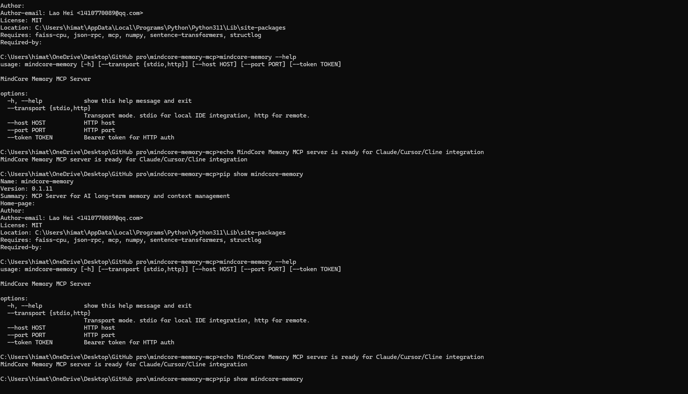

# Production-Hardened MCP Memory Server — Hybrid Search + Resilience for AI Agents

**The only MCP memory server with circuit breaker, SLO tracking, and BM25+FAISS hybrid search.**
AI agents forget everything between sessions. MindCore Memory gives them persistent, searchable, production-grade memory — with 118/118 tests passing and full CI/CD.

> ⭐ **If this project helps your AI remember, a star means the world to us.**

[](https://github.com/woshilaohei/mindcore-memory-mcp/actions)
[](https://pypi.org/project/mindcore-memory/)
[](https://pypi.org/project/mindcore-memory/)
[](https://opensource.org/licenses/MIT)
[](https://pypi.org/project/mindcore-memory/)
[](https://registry.modelcontextprotocol.io/servers/io.github.woshilaohei/mindcore-memory)
[](https://github.com/woshilaohei/mindcore-memory-mcp/stargazers)

<p align="center">
  
</p>

---

## Quick Start

```bash
# 1. Install
pip install mindcore-memory

# 2. Launch (stdio mode — works with any MCP client)
mindcore-memory

# 3. Your AI agent remembers across sessions
```

<details>
<summary><b>MCP Client Config (Claude Desktop / Cursor / Cline)</b></summary>

```json
{
  "mcpServers": {
    "mindcore-memory": {
      "command": "python",
      "args": ["-m", "mindcore_memory.server"],
      "env": { "MINDCORE_MEMORY_PATH": "~/.mindcore/memory" }
    }
  }
}
```

</details>

<details>
<summary><b>Optional: Semantic Search</b></summary>

```bash
pip install mindcore-memory[semantic]
# Enables FAISS embeddings for hybrid BM25+semantic search
```

</details>

---

## Why MindCore — vs the Competition

| Feature | **MindCore Memory** | Mem0 | SynaBun | Letta (MemGPT) |
|---------|---------------------|------|---------|----------------|
| **Search** | BM25 + FAISS Hybrid | FAISS only | sqlite-vec only | FAISS only |
| **Circuit Breaker** | ✅ 3-state | ❌ | ❌ | ❌ |
| **Retry (exp. backoff)** | ✅ | ❌ | ❌ | ❌ |
| **SLO Tracking** | ✅ P95/P99 | ❌ | ❌ | ❌ |
| **Prometheus Metrics** | ✅ `/metrics` | ❌ | ❌ | ❌ |
| **Encryption at Rest** | ✅ Fernet | ❌ | ❌ | ❌ |
| **Deduplication** | ✅ Exact-match merge | ⚠️ Partial | ❌ | ❌ |
| **IVF Index (500+)** | ✅ Auto-switch | ❌ | ❌ | ❌ |
| **Local-First** | ✅ Zero deps | ✅ (cloud optional) | ✅ | ❌ (needs Docker) |
| **CI/CD Pipeline** | ✅ Auto → PyPI + MCP | ⚠️ Manual | ❌ | ❌ |
| **Tests** | 118/118 (100%) | Unknown | Unknown | Unknown |
| **License** | MIT | Apache 2.0 | Apache 2.0 | Apache 2.0 |

**MindCore is the only MCP memory server designed for production workloads from day one.** Circuit breaker protects against embedding service failures. Retry with exponential backoff handles transient errors. SLO tracking alerts you before users notice. Metrics export for your monitoring stack. Every other server assumes nothing fails — MindCore doesn't.

---

## Unique: 3D Boundary Balance Algorithm

MindCore is not just a memory store — it's a **cognitive boundary engine**. Every stored memory is automatically evaluated through a 4-dimensional scoring system based on the **正反公式 (Forward/Reverse Formula)**:

```
BND_score = 0.28·TRJ(Trajectory) + 0.28·EVO(Evolution) + 0.28·COG(Cognition) + 0.16·BALANCE
```

- **Forward cycle**: TRJ → BND → EVO → COG → BND (each step draws a boundary, each boundary is growth)
- **Reverse chain**: Chaos → Unknown → Risk → Harm → Death (2+ linked triggers → auto 50% score penalty)
- **3D balance**: Variance across TRJ/EVO/COG penalizes lopsided memories (pure data dumps without insight)
- **No LLM calls**: Pure algorithmic evaluation using keyword patterns, regex, and statistical variance

```python
from mindcore_memory import BNDManager
bnd = BNDManager()
result = bnd.evaluate("基于之前修复, 理解到根因, 改进后提升30%", importance=4)
# → TRJ:0.63  EVO:0.54  COG:0.61  BALANCE:0.98  BND:0.75  ACCEPTED
```

> 📖 [Full algorithm documentation](docs/boundary-algorithm.md)

**No other MCP memory server does this.** BND transforms memory storage from a passive data dump into an active cognitive filter — rejecting noise, flagging risk chains, and ensuring only structured, growth-oriented knowledge enters the version chain.

---

## Production Features

### Resilience Layer
- **Circuit Breaker**: CLOSED → OPEN → HALF_OPEN state machine. Protects FAISS/embedding operations from cascading failure.
- **Retry**: Exponential backoff with jitter. Transient errors retry automatically, permanent errors fail fast.
- **Input Validation**: Server-level sanitization against injection attacks.

### Observability Layer
- **SLO Tracking**: P95/P99 latency targets for all 6 operations. Violations logged and exported.
- **Prometheus `/metrics`**: Zero-dependency Prometheus-compatible collector. Drop-in for any monitoring stack.

### Data Layer
- **Encryption**: Optional Fernet encryption at rest (`mindcore-memory[encrypt]`).
- **Deduplication**: Exact-match merge — identical memory updates importance/confidence instead of storing duplicates.
- **Smart Eviction**: Low-importance memory pruning with atomic disk sync. No zombie memories.

---

## Core Tools

### Memory (6 tools)
| Tool | Description | Key Parameters |
|------|-------------|---------------|
| `memory_store` | Persist a memory (auto-BND evaluated) | `content`, `importance` (1-4), `tags`, `confidence` |
| `memory_recall` | Search memories (BM25+FAISS hybrid) | `query`, `tags`, `limit`, `session_id` |
| `memory_context` | Build LLM context window | `query`, `max_tokens`, `session_id` |
| `memory_update_confidence` | Adjust memory confidence | `memory_id`, `confidence` |
| `memory_delete` | Remove a memory | `memory_id` |
| `memory_stats` | System statistics | (no args) |

### Boundary & Deduction (3 tools) 🆕
| Tool | Description | Key Parameters |
|------|-------------|---------------|
| `bnd_check` | 4D boundary evaluation (TRJ/EVO/COG/BALANCE + Anti-Chain) | `content`, `importance`, `confidence`, `tags` |
| `bnd_stats` | BND manager stats: acceptance rate, scores, anti-chain triggers | (no args) |
| `deduce` | Cognitive deduction: pattern extraction from high-quality memories | `query`, `tags` |

**Search formula**: `score = BM25(40%) + FAISS(50%) + importance(5%) + recency(5%)`

When FAISS embeddings are unavailable, automatically falls back to BM25-only keyword search.

---

## Architecture

```
┌───────────────────┐     MCP JSON-RPC      ┌────────────────────────────┐
│  AI Client         │ ◄──────────────────► │  MindCore Memory           │
│  (Claude/Cursor)   │     stdio / HTTP     │  MCP Server                │
└───────────────────┘                       └──────────┬─────────────────┘
                                                       │
                                            ┌──────────▼─────────────────┐
                                            │  Memory Engine             │
                                            │  ┌──────────────────────┐  │
                                            │  │ Hybrid Search        │  │
                                            │  │  BM25 (keyword) 40%  │  │
                                            │  │  FAISS (semantic)50%│  │
                                            │  │  importance        5%│  │
                                            │  │  recency           5%│  │
                                            │  └──────────────────────┘  │
                                            │  ┌──────────────────────┐  │
                                            │  │ Resilience           │  │
                                            │  │  Circuit Breaker     │  │
                                            │  │  Retry + Backoff     │  │
                                            │  │  SLO Tracking        │  │
                                            │  └──────────────────────┘  │
                                            └──────────┬─────────────────┘
                                                       │
                                            ┌──────────▼─────────────────┐
                                            │  Storage                   │
                                            │  JSONL (append)            │
                                            │  + FAISS index (IVF > 500) │
                                            │  + Fernet encrypt (opt)    │
                                            └────────────────────────────┘
```

- **Embedded**: No PostgreSQL, Redis, or external services needed. One binary, local JSONL + FAISS.
- **IVF Index**: FAISS inverted file index activates at 500+ memories for O(√N) search.
- **MCP Native**: Full MCP protocol over stdio and HTTP transports.

---

## Available On

| Platform | Status | Link |
|----------|--------|------|
| **PyPI** | Published v0.1.11 | [`mindcore-memory`](https://pypi.org/project/mindcore-memory/) |
| **MCP Registry** | Registered | [View](https://registry.modelcontextprotocol.io/servers/io.github.woshilaohei/mindcore-memory) |
| **Glama** | Listed | [View](https://glama.ai/mcp/servers/woshilaohei/mindcore-memory-mcp) |
| **MCP Market** | Listed | [View](https://mcpmarket.com/zh/server/mindcore-memory) |
| **MCP.so** | Listed | [View](https://mcp.so) |
| **LobeHub** | Listed | [View](https://lobehub.com/zh/mcp/woshilaohei-mindcore-memory-mcp) |
| **mcpservers.org** | Listed | [View](https://mcpservers.org) |

---

## Full Comparison

See [docs/comparison.md](docs/comparison.md) for a detailed 5-server comparison covering architecture, search quality, latency, and migration guides.

---

## Contributing

See [CONTRIBUTING.md](CONTRIBUTING.md) for the full guide. Quick path:

```bash
git clone https://github.com/woshilaohei/mindcore-memory-mcp.git
cd mindcore-memory-mcp
pip install -e ".[dev]"
pytest -v              # 118 tests
ruff check .           # linter
mypy mindcore_memory/  # type checker
```

---

## License

MIT License — Copyright (c) 2025 Lao Hei

---

<div align="center">

**[⬆ back to top](#production-hardened-mcp-memory-server--hybrid-search--resilience-for-ai-agents)**

⭐ **If MindCore helps your AI remember, give it a star!** ⭐

</div>
